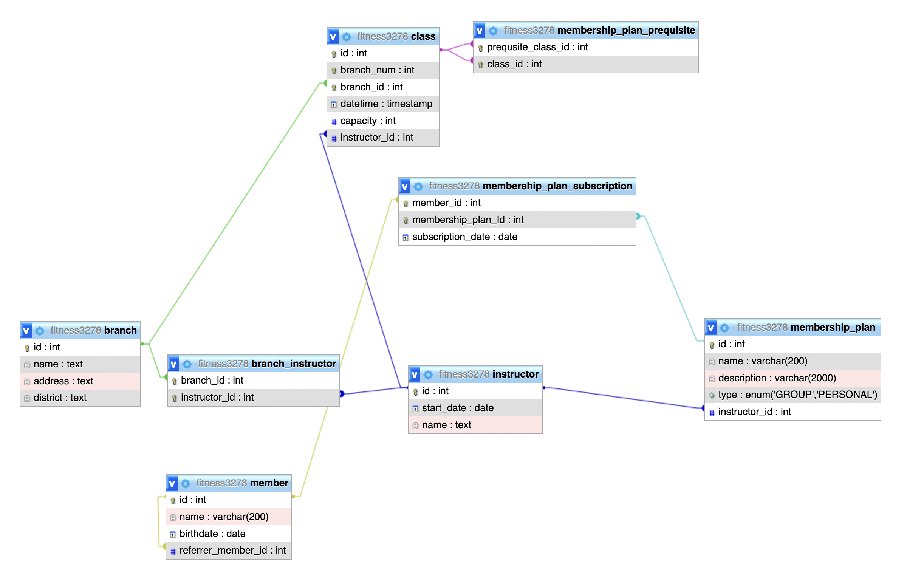

# COMP3278 2022 Assignment 1

## ER Diagram



## Texturel prepresentation in form of MYSQL table creation statements

```sql
SET SQL_MODE = "NO_AUTO_VALUE_ON_ZERO";
SET time_zone = "+00:00";

/*!40101 SET @OLD_CHARACTER_SET_CLIENT=@@CHARACTER_SET_CLIENT */;
/*!40101 SET @OLD_CHARACTER_SET_RESULTS=@@CHARACTER_SET_RESULTS */;
/*!40101 SET @OLD_COLLATION_CONNECTION=@@COLLATION_CONNECTION */;
/*!40101 SET NAMES utf8mb4 */;


CREATE TABLE `branch` (
  `id` int NOT NULL,
  `name` text NOT NULL,
  `address` text NOT NULL,
  `district` text NOT NULL
) ENGINE=InnoDB DEFAULT CHARSET=utf8mb4 COLLATE=utf8mb4_0900_ai_ci;

CREATE TABLE `branch_instructor` (
  `branch_id` int NOT NULL,
  `instructor_id` int NOT NULL
) ENGINE=InnoDB DEFAULT CHARSET=utf8mb4 COLLATE=utf8mb4_0900_ai_ci;

CREATE TABLE `class` (
  `id` int NOT NULL,
  `branch_num` int NOT NULL,
  `branch_id` int NOT NULL,
  `datetime` timestamp NOT NULL DEFAULT CURRENT_TIMESTAMP,
  `capacity` int NOT NULL,
  `instructor_id` int NOT NULL
) ENGINE=InnoDB DEFAULT CHARSET=utf8mb4 COLLATE=utf8mb4_0900_ai_ci;

CREATE TABLE `instructor` (
  `id` int NOT NULL,
  `start_date` date NOT NULL COMMENT 'year of experience can be deduced from this',
  `name` text NOT NULL
) ENGINE=InnoDB DEFAULT CHARSET=utf8mb4 COLLATE=utf8mb4_0900_ai_ci;

CREATE TABLE `member` (
  `id` int NOT NULL,
  `name` varchar(200) NOT NULL,
  `birthdate` date NOT NULL,
  `referrer_member_id` int NOT NULL
) ENGINE=InnoDB DEFAULT CHARSET=utf8mb4 COLLATE=utf8mb4_0900_ai_ci;

CREATE TABLE `membership_plan` (
  `id` int NOT NULL,
  `name` varchar(200) NOT NULL,
  `description` varchar(2000) NOT NULL,
  `type` enum('GROUP','PERSONAL') NOT NULL,
  `instructor_id` int DEFAULT NULL
) ENGINE=InnoDB DEFAULT CHARSET=utf8mb4 COLLATE=utf8mb4_0900_ai_ci;

CREATE TABLE `membership_plan_prequisite` (
  `prequsite_class_id` int NOT NULL,
  `class_id` int NOT NULL
) ENGINE=InnoDB DEFAULT CHARSET=utf8mb4 COLLATE=utf8mb4_0900_ai_ci;

CREATE TABLE `membership_plan_subscription` (
  `member_id` int NOT NULL,
  `membership_plan_Id` int NOT NULL,
  `subscription_date` date NOT NULL
) ENGINE=InnoDB DEFAULT CHARSET=utf8mb4 COLLATE=utf8mb4_0900_ai_ci;


ALTER TABLE `branch`
  ADD PRIMARY KEY (`id`);
ALTER TABLE `branch` ADD FULLTEXT KEY `name` (`name`);
ALTER TABLE `branch` ADD FULLTEXT KEY `address` (`address`);
ALTER TABLE `branch` ADD FULLTEXT KEY `district` (`district`);

ALTER TABLE `branch_instructor`
  ADD UNIQUE KEY `branch_instructor_id` (`branch_id`,`instructor_id`) USING BTREE,
  ADD KEY `branch_instructor_instructor_id` (`instructor_id`);

ALTER TABLE `class`
  ADD PRIMARY KEY (`id`),
  ADD UNIQUE KEY `branch_num` (`branch_id`,`branch_num`),
  ADD KEY `branch_id` (`branch_id`),
  ADD KEY `instructor_id` (`instructor_id`);

ALTER TABLE `instructor`
  ADD PRIMARY KEY (`id`),
  ADD KEY `start_date` (`start_date`);
ALTER TABLE `instructor` ADD FULLTEXT KEY `name` (`name`);

ALTER TABLE `member`
  ADD PRIMARY KEY (`id`),
  ADD KEY `referrer_member_id` (`referrer_member_id`);
ALTER TABLE `member` ADD FULLTEXT KEY `name` (`name`);

ALTER TABLE `membership_plan`
  ADD PRIMARY KEY (`id`),
  ADD KEY `instructor_id` (`instructor_id`);
ALTER TABLE `membership_plan` ADD FULLTEXT KEY `name` (`name`);

ALTER TABLE `membership_plan_prequisite`
  ADD UNIQUE KEY `prequsite_class_id_class_id` (`class_id`,`prequsite_class_id`),
  ADD KEY `class_id` (`class_id`),
  ADD KEY `prequsite_class_id` (`prequsite_class_id`);

ALTER TABLE `membership_plan_subscription`
  ADD UNIQUE KEY `member_id_2` (`member_id`,`membership_plan_Id`),
  ADD KEY `member_id` (`member_id`),
  ADD KEY `membership_plan_Id` (`membership_plan_Id`);


ALTER TABLE `branch`
  MODIFY `id` int NOT NULL AUTO_INCREMENT;

ALTER TABLE `class`
  MODIFY `id` int NOT NULL AUTO_INCREMENT;

ALTER TABLE `instructor`
  MODIFY `id` int NOT NULL AUTO_INCREMENT;

ALTER TABLE `member`
  MODIFY `id` int NOT NULL AUTO_INCREMENT;

ALTER TABLE `membership_plan`
  MODIFY `id` int NOT NULL AUTO_INCREMENT;


ALTER TABLE `branch_instructor`
  ADD CONSTRAINT `branch_instructor_branch_id` FOREIGN KEY (`branch_id`) REFERENCES `branch` (`id`) ON DELETE RESTRICT ON UPDATE RESTRICT,
  ADD CONSTRAINT `branch_instructor_instructor_id` FOREIGN KEY (`instructor_id`) REFERENCES `instructor` (`id`) ON DELETE RESTRICT ON UPDATE RESTRICT;

ALTER TABLE `class`
  ADD CONSTRAINT `class_branch_id` FOREIGN KEY (`branch_id`) REFERENCES `branch` (`id`) ON DELETE RESTRICT ON UPDATE RESTRICT,
  ADD CONSTRAINT `class_instructor_id` FOREIGN KEY (`instructor_id`) REFERENCES `instructor` (`id`) ON DELETE RESTRICT ON UPDATE RESTRICT;

ALTER TABLE `member`
  ADD CONSTRAINT `member_ibfk_1` FOREIGN KEY (`referrer_member_id`) REFERENCES `member` (`id`) ON DELETE RESTRICT ON UPDATE RESTRICT;

ALTER TABLE `membership_plan`
  ADD CONSTRAINT `membership_plan_instructor_id` FOREIGN KEY (`instructor_id`) REFERENCES `instructor` (`id`) ON DELETE RESTRICT ON UPDATE RESTRICT;

ALTER TABLE `membership_plan_prequisite`
  ADD CONSTRAINT `membership_plan_prequisite_class_id` FOREIGN KEY (`class_id`) REFERENCES `class` (`id`) ON DELETE RESTRICT ON UPDATE RESTRICT,
  ADD CONSTRAINT `membership_plan_prequisite_prequisite_class_id` FOREIGN KEY (`prequsite_class_id`) REFERENCES `class` (`id`) ON DELETE RESTRICT ON UPDATE RESTRICT;

ALTER TABLE `membership_plan_subscription`
  ADD CONSTRAINT `membership_plan_subscription_ibfk_1` FOREIGN KEY (`membership_plan_Id`) REFERENCES `membership_plan` (`id`) ON DELETE RESTRICT ON UPDATE RESTRICT,
  ADD CONSTRAINT `membership_plan_subscription_ibfk_2` FOREIGN KEY (`member_id`) REFERENCES `member` (`id`) ON DELETE RESTRICT ON UPDATE RESTRICT;

/*!40101 SET CHARACTER_SET_CLIENT=@OLD_CHARACTER_SET_CLIENT */;
/*!40101 SET CHARACTER_SET_RESULTS=@OLD_CHARACTER_SET_RESULTS */;
/*!40101 SET COLLATION_CONNECTION=@OLD_COLLATION_CONNECTION */;

```